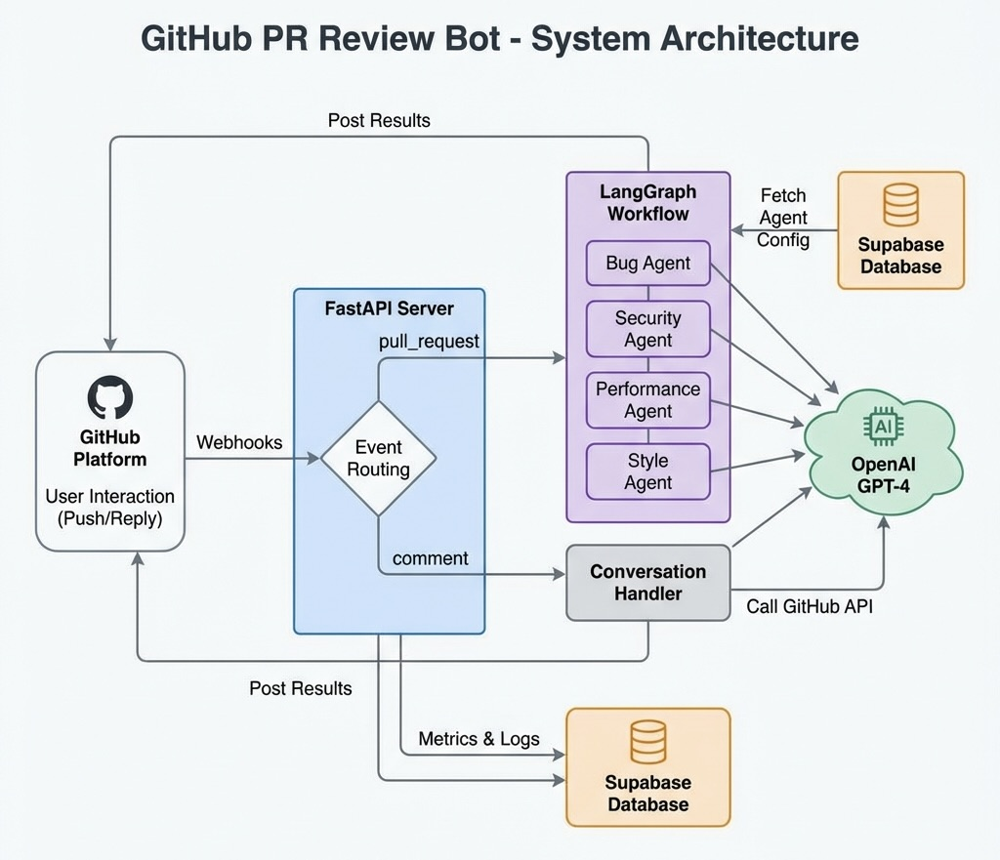
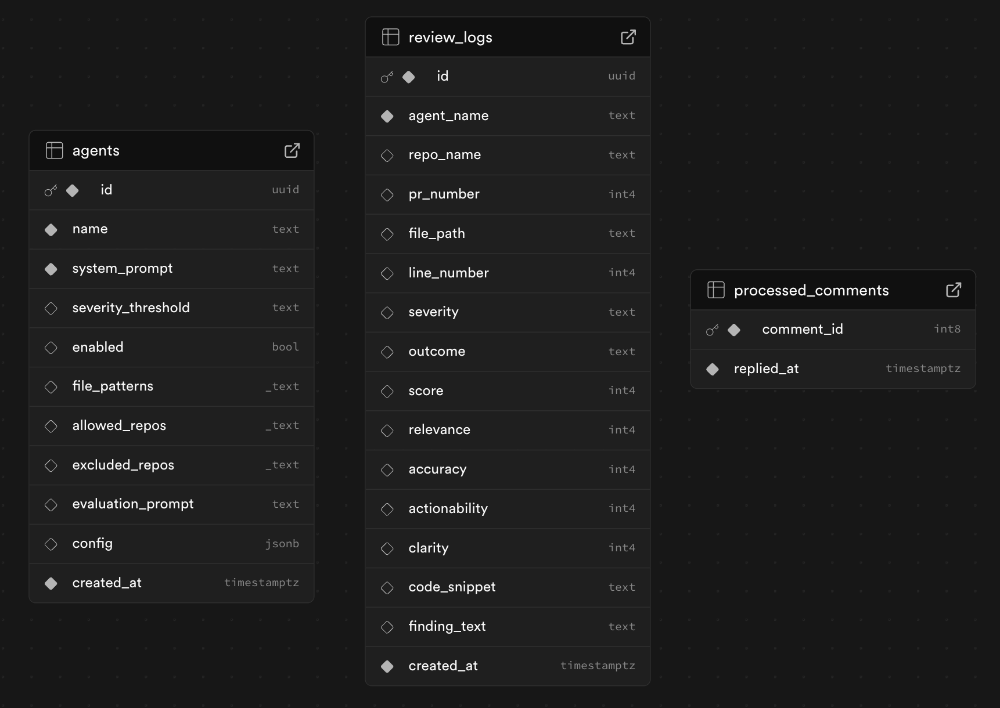
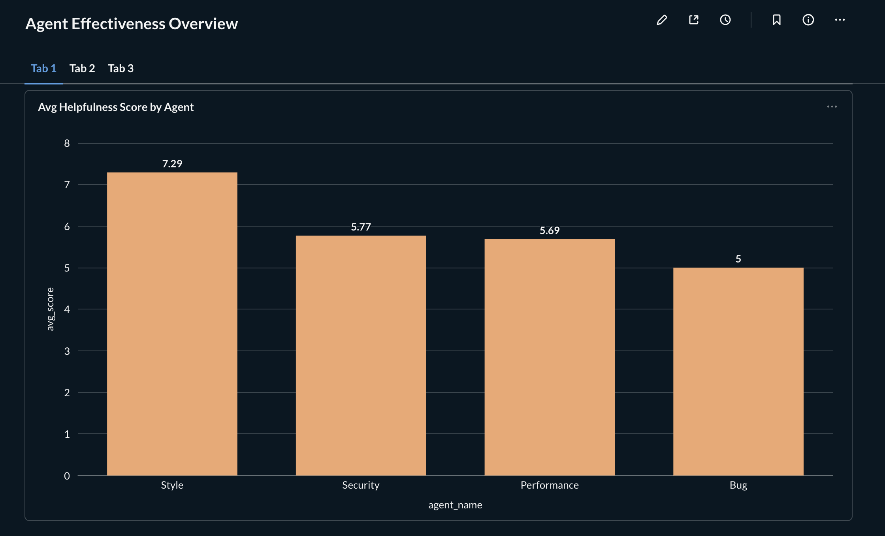
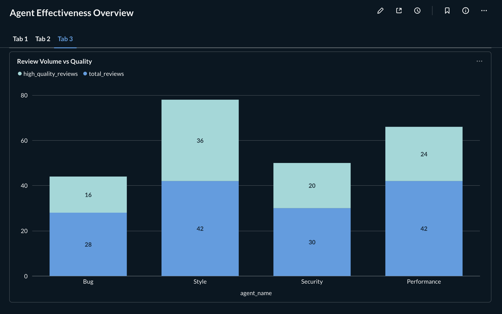
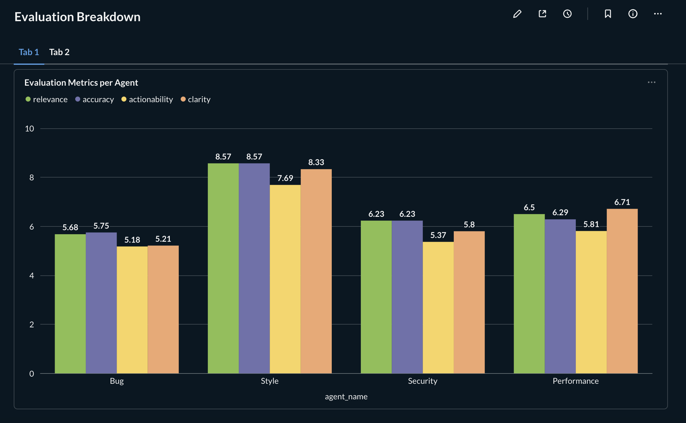
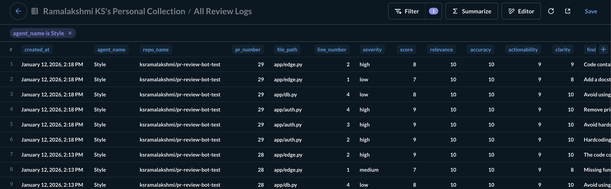
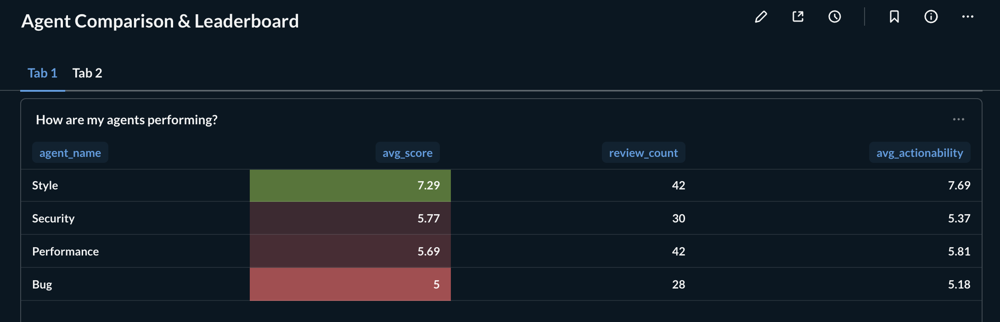

# Interactive GitHub PR Review Bot

A powerful, intelligent, and interactive bot that automatically reviews GitHub Pull Requests. It uses a graph-based agent architecture (LangGraph) to deploy specialized agents (Bug, Security, Performance, Style) that can be dynamically managed via Supabase.

**Key Features**:
- **Multi-Agent Reviews**: Multiple specialized agents review your code.
- **Dynamic Configuration**: Enable/Disable agents or update their prompts instantly via Supabase.
- **Conversational**: Reply to the bot's comments (e.g., "Why is this a bug?") and it will answer contextually.
- **Metric Tracking**: Automatically tracks the helpfulness, accuracy, and relevance of every finding.

## System Architecture

The system is built on an event-driven architecture using **FastAPI**, **LangGraph**, and **Supabase**.



## Setup Instructions

### 1. Prerequisites
- **Python 3.9+**
- **Supabase Account**: A new project for storing agent configs and logs.
- **OpenAI API Key**: For LLM inference.
- **GitHub**: Personal Access Token (PAT) with repo permissions.
- **ngrok** (for local development): To expose your local server to GitHub webhooks.

### 2. Installation

1.  **Clone the repository**:
    ```bash
    git clone https://github.com/ksramalakshmi/Interactive-Github-PR-Review-Bot.git
    git checkout conversational 
    cd Interactive-Github-PR-Review-Bot
    ```

2.  **Create Virtual Environment**:
    ```bash
    python3 -m venv .venv
    source .venv/bin/activate
    ```

3.  **Install Dependencies**:
    ```bash
    pip install -r requirements.txt
    ```

### 3. Database Setup (Supabase)

1.  Go to your Supabase Project > **SQL Editor**.
2.  Run the contents of `supa_schema.sql` to create the necessary tables (`agents`, `review_logs`, `processed_comments`) and default agents.
3.  Note down your `SUPABASE_URL` and `SUPABASE_SERVICE_ROLE_KEY`.



### 4. Configuration

Create a `.env` file in the root directory:

```env
OPENAI_API_KEY="your api key"
GITHUB_TOKEN="your token"
GITHUB_WEBHOOK_SECRET="your_webhook_secret"
SUPABASE_URL="https://your-project.supabase.co"
SUPABASE_SERVICE_ROLE_KEY="your_service_role_key"
```

## GitHub Webhook Configuration

### 1. Create a GitHub Webhook
1.  Go to your Repository > **Settings** > **Webhooks**.
2.  Click **Add webhook**.
3.  **Payload URL**: `<your-ngrok-url>/webhook`
4.  **Content type**: `application/json`
5.  **Secret**: Must match `GITHUB_WEBHOOK_SECRET` in `.env`.

### 2. Select Events
Enable:
- [x] **Pull requests** (Triggers reviews)
- [x] **Pull request review comments** (Triggers conversational replies)

## Running the Bot

### Start the Backend
You can run the application using `uvicorn`:

```bash
uvicorn app.main:app --reload --port 8000
```

### Expose Local Server
If running locally, use ngrok to forward requests:
```bash
ngrok http 8000
```
*Update your GitHub Webhook URL with the new ngrok address everytime you end the ngrok tunnel.*

## Agent Management

You can manage agents dynamically without restarting the server by editing the `agents` table in Supabase.

- **Enable/Disable**: Toggle the `enabled` boolean.
- **Severity**: Change validation strictness (`low`, `medium`, `high`).
- **Context**: Update `file_patterns` (e.g., `["*.py"]`) or `allowed_repos` to restrict where agents run.
- **Prompts**: Tweak `system_prompt` or `evaluation_prompt` to refine behavior.

## Features

### Automated Reviews
When a PR is opened or synced, the bot:
1.  Fetches the diff.
2.  Identifies modified files.
3.  Queries Supabase for active agents matching the repo/files.
4.  Runs agents in parallel (via LangGraph).
5.  Deduplicates findings.
6.  Posts specific review comments to GitHub.

### Conversational Replies
If you reply to a bot comment:
1.  The bot detects the `pull_request_review_comment` event.
2.  It analyzes your question + the original code context.
3.  It replies in the thread with a helpful answer.
    *   *Note: It is smart enough to ignore its own comments!*

### Metrics & Evaluation
Every finding is scored (0-10) on:
- **Relevance**
- **Accuracy**
- **Actionability**
- **Clarity**

These logs are saved to the `review_logs` table in Supabase, allowing you to monitor agent quality over time.

## Metabase Dashboards

**Review-agent analytics layer** is powered by **Metabase** to measure and improve the quality of AI-generated PR reviews over time. It is connected to the Supabase project and the dashboards are updated in real-time.

These dashboards help answer critical questions:
- Which agents are actually useful?
- Are agents improving or degrading over time?
- Do multiple agents agree on the same PR?
- Which agents should be tuned, limited, or disabled?

### Setting up Metabase

Run the following docker command to pull the metabase image

```bash
docker run -d -p 3000:3000 --name metabase metabase/metabase
```

The app is running on port `3000` locally in your system. Navigate to https://localhost:3000 to access the Metabase UI and connect to Supabase with its internal Postgres configurations.

### Review Helpfulness Trends
Tracks overall agent performance over time.



### Per-Agent Evaluation Breakdown
Compares agents across evaluation dimensions.



### Same PR, Multiple Agents Analysis
Analyzes how different agents review the **same PR**.



### Review History Explorer
Detailed audit trail of all reviews.



### Agent Performance Leaderboard
Ranks agents by effectiveness.


